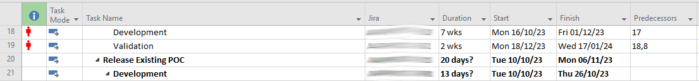
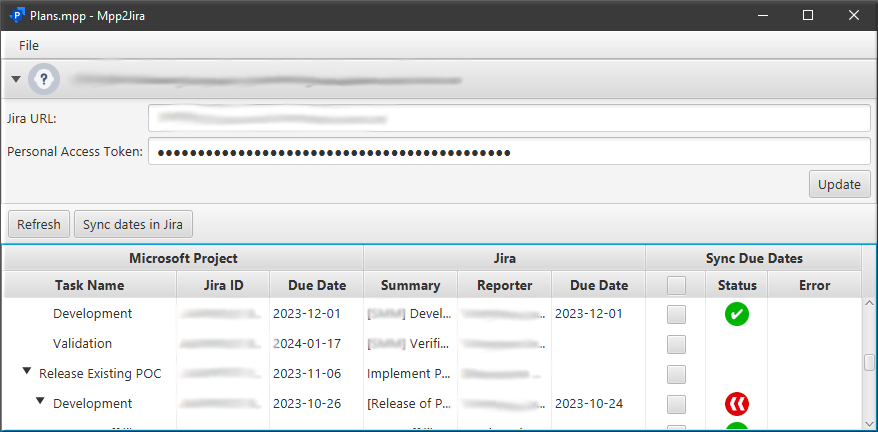

# mpp2jira

Sync due dates from Project to Jira

## Releases

[Latest release](https://github.com/gvergine/mpp2jira/releases/tag/v1.0.0.0) of mpp2jira.exe is 1.0.0.0. 

## How to use

1. Create a Personal Access Token in Jira

2. Add a column named "Jira" with the Jira ticket (e.g. AS-123) in the Project file

.

3. Start mpp2jira and update the Jira URL and the Personal Access Token

4. Load from the menubar the .mpp file

5. Select the tasks whose due date should be updated in jira, and synchronize them with the button "Sync dates in Jira"

.
